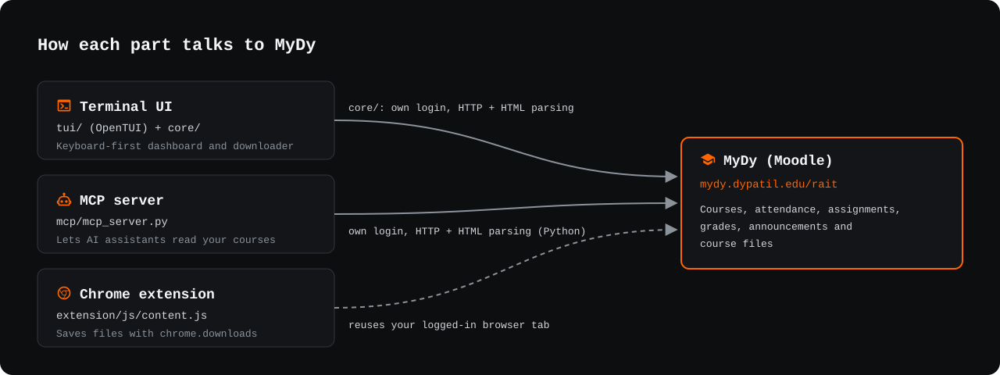

# Contributing



## Develop

With [Bun](https://bun.com) 1.3+:

```sh
bun install
bun run tui         # run the terminal UI
bun run test        # core + tui tests
bun run typecheck
bun run smoke       # read-only check against the real MyDy, using .env
bun run build       # binary for this machine in tui/dist/
```

`bun run --cwd tui screenshot`, `artwork` and `site` regenerate the README images and the website demo.

## Layout

```
core/        TypeScript MyDy client: sign-in, parsers, transport (shared)
tui/         OpenTUI (Solid) terminal app
mcp/         Python MCP server
extension/   Chrome extension (MV3)
site/        GitHub Pages website
docs/assets/ README artwork
```

## Release

| To release | Do this |
|---|---|
| TUI binaries | Push a `v*` tag, e.g. `v6.0.0` |
| Extension zip | Push an `ext-v*` tag matching `extension/package.json`, or run the **Build and Release Extension** workflow |

The website deploys on every push to `main` that touches `site/`, `core/src/` or `tui/src/`.
