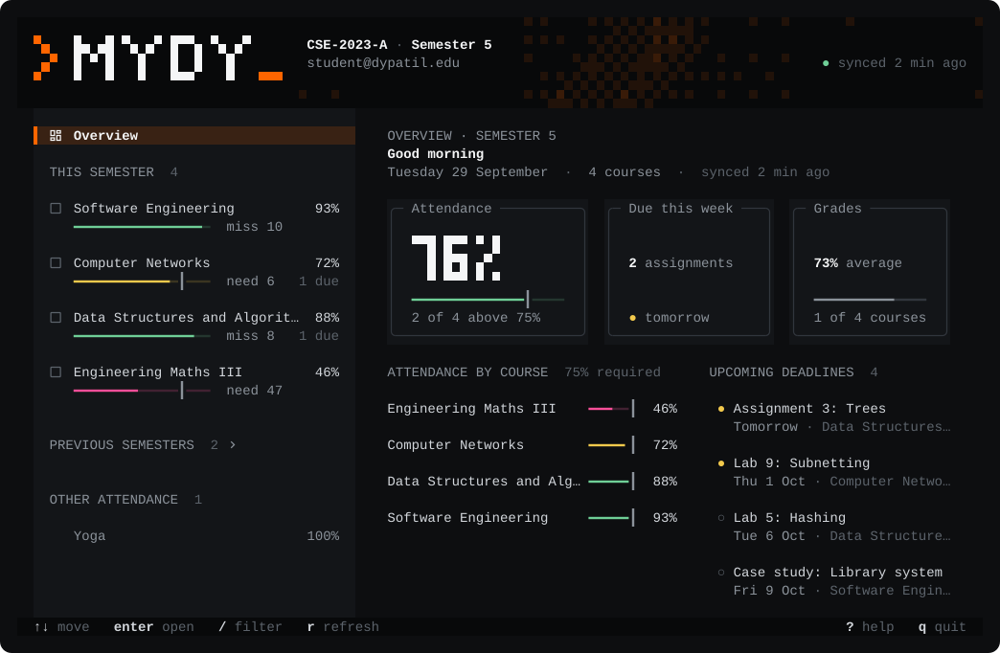

<div align="center">


<br>
<br>

[](https://github.com/Deeptanshuu/mydy-lms-helper/releases)
[](https://github.com/Deeptanshuu/mydy-lms-helper/releases)
[](#license)

**[Website and live demo](https://deeptanshuu.github.io/mydy-lms-helper/)** &nbsp;&nbsp;|&nbsp;&nbsp; **[Releases](https://github.com/Deeptanshuu/mydy-lms-helper/releases)**

</div>

<br>



A better way to use MyDy, the D.Y. Patil LMS: attendance, deadlines and grades on one screen, every course's notes in one download, and your AI assistant plugged into your courses.

| | | |
|---|---|---|
| **[Terminal UI](tui/)** | Everything on one screen, bulk downloads, works offline | [Docs](tui/README.md) |
| **[MCP server](mcp/)** | Ask Claude or any MCP client about your courses | [Docs](mcp/README.md) |
| **[Chrome extension](extension/)** | Download course files from the browser | [Docs](extension/README.md) |

## Quick start

Grab the binary for your system from [Releases](https://github.com/Deeptanshuu/mydy-lms-helper/releases), or run from source with [Bun](https://bun.com):

```sh
git clone https://github.com/Deeptanshuu/mydy-lms-helper.git
cd mydy-lms-helper && bun install && bun run tui
```

Contributing: see [CONTRIBUTING.md](CONTRIBUTING.md).

## License

MIT. Unofficial, not affiliated with D.Y. Patil or MyDy. Your login is only sent to MyDy; only download what you already have access to.
