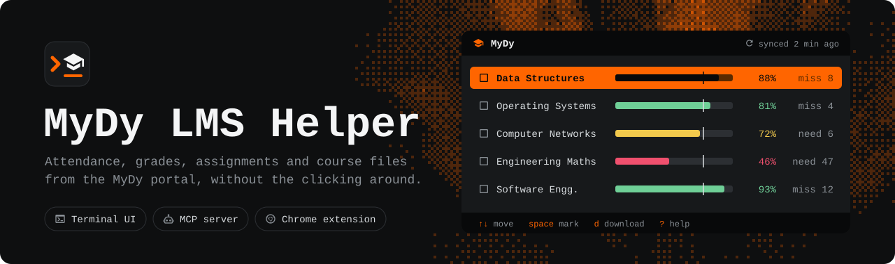
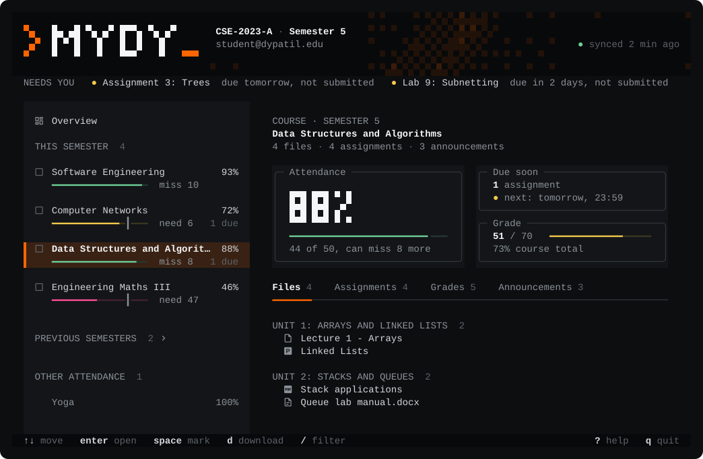
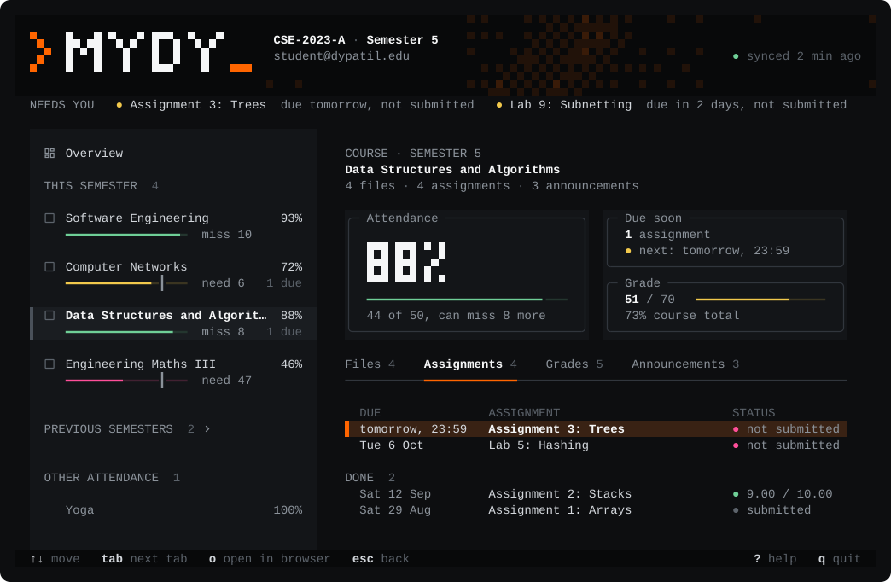

<div align="center">



<br>
<br>

[](https://github.com/Deeptanshuu/mydy-lms-helper/releases)
[](https://github.com/Deeptanshuu/mydy-lms-helper/releases)
[](https://bun.com)
[](https://opentui.com)
[](#mcp-server)
[](extension/manifest.json)
[](#license)

**[Terminal UI](#terminal-ui)** &nbsp;&nbsp;|&nbsp;&nbsp; **[MCP server](#mcp-server)** &nbsp;&nbsp;|&nbsp;&nbsp; **[Chrome extension](#chrome-extension)** &nbsp;&nbsp;|&nbsp;&nbsp; **[Releases](https://github.com/Deeptanshuu/mydy-lms-helper/releases)**

</div>

<br>



<details>
<summary><b>Assignments tab</b></summary>
<br>



</details>

## What's in this repo

A better way to use the MyDy (Moodle-based) LMS at D.Y. Patil institutions. The portal spreads your attendance, deadlines, grades and notes across page after page; this puts them on one fast screen you can drive with the keyboard or the mouse, and plugs your AI assistant into your courses. Unofficial and open source. Try the live demo on the [website](https://deeptanshuu.github.io/mydy-lms-helper/).

| Part | Folder | Use it to |
|---|---|---|
| **Terminal UI** | [`tui/`](tui/) + [`core/`](core/) | See attendance, deadlines, grades and announcements at a glance, and download course files |
| **MCP server** | [`mcp/`](mcp/) | Ask Claude Code or another AI assistant about your courses |
| **Chrome extension** | [`extension/`](extension/) | Download course files straight from the browser |


---

## Terminal UI

- **Attendance you can act on**: every subject against the 75% requirement, with how many classes you can still miss or must attend in a row
- **Needs you**: a strip at the top with deadlines in the next week you haven't submitted, and subjects below 75%
- **One screen per course**: files, assignments, grades and announcements in tabs, next to the course list
- **Downloads**: mark courses with `space`, press `d`; files already downloaded are skipped
- **Works offline**: your last sync is cached, so it opens instantly and still shows your data without a connection
- **Keyboard first, mouse friendly**: click to select, click again to open, scroll lists; press `?` for every key

### Install

Or visit the [website](https://deeptanshuu.github.io/mydy-lms-helper/) for a live demo.

Download the binary for your system from [Releases](https://github.com/Deeptanshuu/mydy-lms-helper/releases) (`mydy-darwin-arm64`, `mydy-linux-x64`, `mydy-windows-x64.exe`, ...) and run it:

```sh
chmod +x mydy-darwin-arm64
xattr -d com.apple.quarantine mydy-darwin-arm64   # macOS only: the binary isn't notarized
./mydy-darwin-arm64
```

Or run it from source with [Bun](https://bun.com) 1.3+:

```sh
git clone https://github.com/Deeptanshuu/mydy-lms-helper.git
cd mydy-lms-helper
bun install
bun run tui
```

### Signing in

The app uses the first of these it finds:

1. `MYDY_USERNAME` and `MYDY_PASSWORD` from the environment or a `.env` file
2. The login you saved with **Remember me** (kept in the system keychain: Keychain on macOS, Credential Manager on Windows, libsecret on Linux)
3. Otherwise it shows a sign-in screen

### Icons

Icons come from [Nerd Fonts](https://www.nerdfonts.com). Use the regular variant (for example **JetBrainsMono Nerd Font**), not the **Mono** one: Mono squeezes every icon into a single cell, so they look tiny. In Ghostty, whose built-in symbols are the Mono size, set `font-family = JetBrainsMono Nerd Font`. Without a Nerd Font you'll see empty boxes; run with `--no-nerd-font` (or set `"nerdFont": false` in the config) for plain symbols.

### Keys

| Key | Does |
|---|---|
| `↑` `↓` / `j` `k` | Move |
| `enter` | Open the course, read an announcement |
| `tab` / `shift+tab` | Next / previous course tab |
| `space` | Mark the course for download |
| `d` | Download the marked courses (or the selected one) |
| `o` | Open the selected item in your browser |
| `/` | Filter courses, including previous semesters |
| `r` | Refresh from MyDy |
| `esc` | Back, close, clear |
| `?` | Help |
| `q` | Quit |

### Configuration

Optional, in `~/.config/mydy/config.json` (Windows: `%APPDATA%\mydy\config.json`):

```json
{
  "downloadDir": "~/Downloads/MyDy",
  "nerdFont": true,
  "threshold": 75
}
```

Downloads go to `<downloadDir>/<course name>/`.

---

## MCP server

Bring your AI assistant into your studies. The MCP server lets Claude Code, Claude Desktop or any [Model Context Protocol](https://modelcontextprotocol.io/) client read your courses, attendance, deadlines, grades and announcements, and download your notes. Ask things like "what's due this week and which subjects am I short on?" or "turn the mid-sem syllabus post into a checklist". It's a standalone Python script in [`mcp/`](mcp/).

```sh
cd mydy-lms-helper
python -m venv .venv
.venv/bin/pip install -r mcp/requirements.txt
```

**Claude Code:**

```sh
claude mcp add mydy-lms \
  -e MYDY_USERNAME=your_email@dypatil.edu \
  -e MYDY_PASSWORD=your_password \
  -- /path/to/mydy-lms-helper/.venv/bin/python /path/to/mydy-lms-helper/mcp/mcp_server.py
```

**Any other MCP client:**

```json
{
  "mcpServers": {
    "mydy-lms": {
      "command": "/path/to/mydy-lms-helper/.venv/bin/python",
      "args": ["/path/to/mydy-lms-helper/mcp/mcp_server.py"],
      "env": {
        "MYDY_USERNAME": "your_email@dypatil.edu",
        "MYDY_PASSWORD": "your_password"
      }
    }
  }
}
```

> [!TIP]
> Point `command` at the Python inside your virtualenv. A bare `python` often isn't on the PATH that MCP clients use.

| Tool | What it does |
|---|---|
| `login` | Sign in to the LMS |
| `list_courses` | List every enrolled course |
| `get_course_content` | List a course's sections and activities |
| `get_assignments` | Show assignments with due dates and submission status |
| `get_grades` | Fetch a course's grade report |
| `get_announcements` | Read a course's announcements |
| `get_attendance` | Show attendance for the current semester |
| `download_course_materials` | Download files from one, several or all courses |

---

## Chrome extension

The extension in [`extension/`](extension/) downloads course files from inside your browser, using your logged-in MyDy tab. It finds the same kinds of material as the TUI: resources, FlexPaper PDFs, presentations, case studies and DY Question modules. More in [`extension/README.md`](extension/README.md).

| | Terminal UI | Chrome extension |
|---|:---:|:---:|
| Attendance, grades, assignments, announcements | Yes | No |
| Download course files | Yes | Yes |
| Bulk download across courses | Yes | Yes |
| Works offline with your last sync | Yes | No |

### Install

1. Download the latest `ext-v*` zip from [Releases](https://github.com/Deeptanshuu/mydy-lms-helper/releases) and extract it, or use the `extension/` folder of this repo.
2. Open `chrome://extensions/` and turn on **Developer mode**.
3. Click **Load unpacked** and pick that folder.
4. Open [mydy.dypatil.edu](https://mydy.dypatil.edu), click the extension icon, log in, choose courses and download.

---

## Development

```sh
bun install
bun run test        # core + tui tests
bun run typecheck
bun run smoke       # read-only check against the real MyDy, using MYDY_USERNAME/MYDY_PASSWORD from .env
bun run build       # compiled binary for this machine in tui/dist/
bun run --cwd tui screenshot   # regenerate the README screenshots
```

```
mydy-lms-helper/
├── core/                  TypeScript MyDy client, shared by the TUI (and later the extension)
│   ├── src/parse/         HTML parsers (standard DOM APIs only)
│   ├── src/client.ts      sign-in, courses, attendance, assignments, grades, files
│   ├── src/bun.ts         Bun transport: cookie jar, redirects, request pacing
│   └── test/              parser tests against sample pages, a fake MyDy server
├── tui/                   OpenTUI (Solid) app
│   ├── src/ui/            screens
│   ├── src/sync.ts        sync order, re-sign-in, offline handling
│   └── src/download.ts    downloads
├── mcp/                   Python MCP server
├── extension/             Chrome extension (MV3)
├── docs/assets/           README artwork
└── .github/workflows/
    ├── tui.yml            builds TUI binaries on v* tags
    └── extension.yml      packages the extension on ext-v* tags
```

### Releases

| To release | Do this |
|---|---|
| TUI binaries (macOS, Linux, Windows) | Push a `v*` tag, e.g. `v6.0.0` |
| Extension zip | Push an `ext-v*` tag that matches `extension/package.json`, e.g. `ext-v1.0.2`, or run the **Build and Release Extension** workflow to bump the version for you |

## License

MIT. Use at your own risk.

> [!IMPORTANT]
> This is an unofficial project for personal and educational use, and isn't associated with D.Y. Patil or MyDy. Follow your institution's terms of service and only download content you already have access to. The author isn't responsible for misuse, data loss or policy violations.
