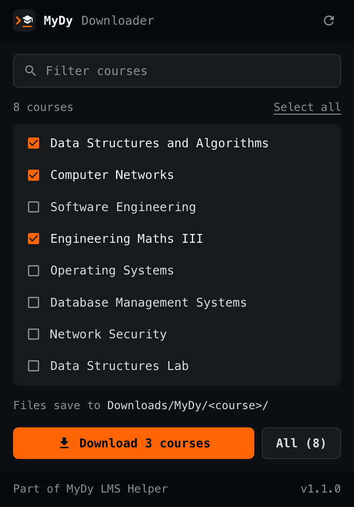
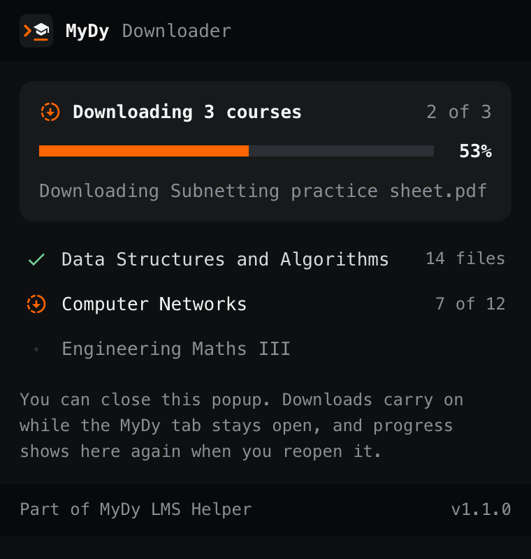
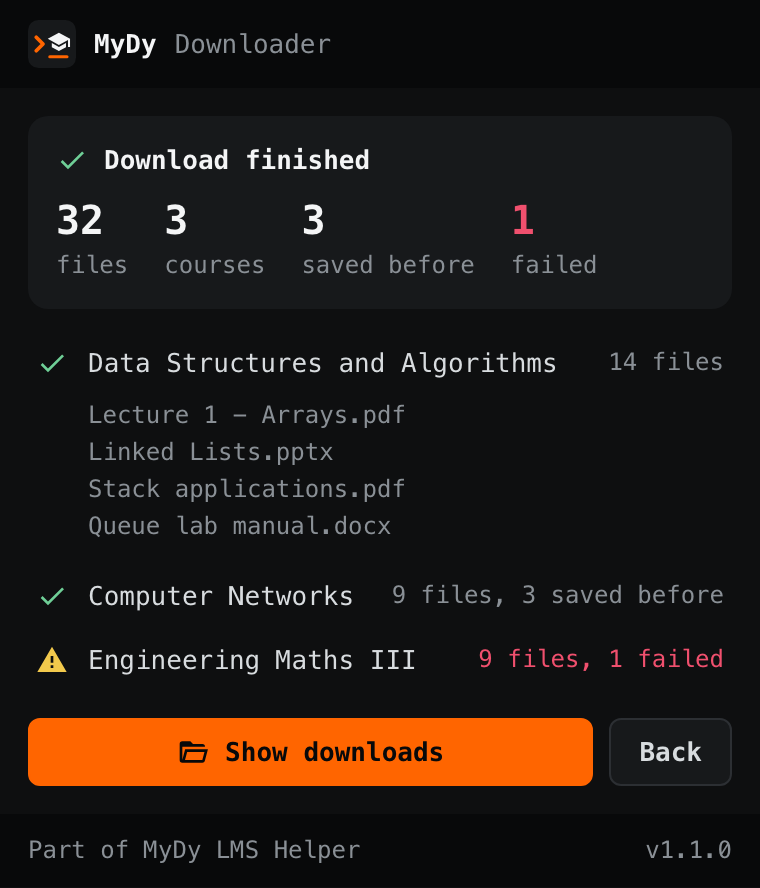

<div align="center">


# MyDy Downloader

Every course's files from MyDy in one go, sorted into a folder per course.

[](https://github.com/Deeptanshuu/mydy-lms-helper/releases)
[](manifest.json)
[](../README.md)

</div>

<br>

<table>
<tr>
<td width="33%"></td>
<td width="33%"></td>
<td width="33%"></td>
</tr>
</table>

Part of [MyDy LMS Helper](../README.md). For attendance, grades and assignments too, use the [terminal UI](../tui/README.md).

Downloads resources, FlexPaper PDFs, presentations, case studies and DY Question modules into `Downloads/MyDy/<course>/`. It uses your signed-in browser session, never sees your password, and only talks to `mydy.dypatil.edu`. It's gentle on MyDy (one request at a time, each file fetched once), skips files you already have, and keeps showing progress if you close and reopen the popup.

## Install

1. Download the latest `ext-v*` zip from [Releases](https://github.com/Deeptanshuu/mydy-lms-helper/releases) and extract it (or use this folder).
2. Open `chrome://extensions/`, turn on **Developer mode**, click **Load unpacked** and pick the folder.
3. Open [mydy.dypatil.edu](https://mydy.dypatil.edu), sign in, click the extension icon, choose courses and download.

No courses showing? That's normal between semesters. Otherwise refresh the MyDy tab and reopen the extension.

## Development

```sh
cd extension
npm install
npm run build:webstore   # builds dist/ and a Chrome Web Store zip
npm run version:patch    # bumps package.json and manifest.json together
npm run screenshots      # re-renders the README screenshots with headless Chrome
```

Releases are built by [`.github/workflows/extension.yml`](../.github/workflows/extension.yml) when an `ext-v*` tag is pushed.

## Disclaimer

Unofficial, for educational use. Follow your institution's terms of service.
