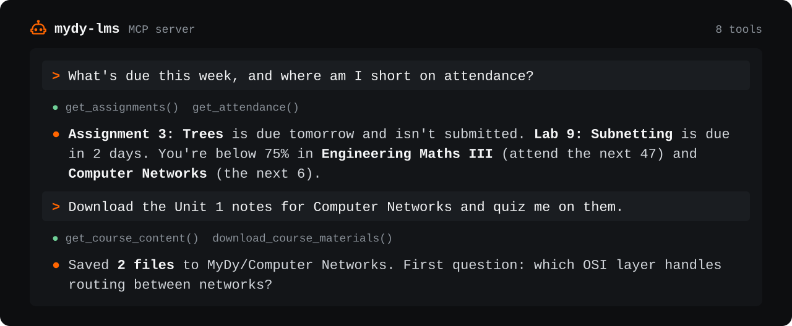

# MCP server

Lets Claude Code, Claude Desktop or any [MCP](https://modelcontextprotocol.io/) client read your MyDy courses, attendance, deadlines, grades and announcements, and download your notes. Part of [MyDy LMS Helper](../README.md).



## Set up

You need a copy of this repo and [uv](https://docs.astral.sh/uv/getting-started/installation/). uv installs the right Python and the server's packages by itself, the same way on macOS, Linux and Windows, so there's no virtualenv to manage.

```sh
git clone https://github.com/Deeptanshuu/mydy-lms-helper.git
cd mydy-lms-helper
```

**Claude Code** (run from the repo folder; `command -v uv` saves uv's full path, so it works whatever PATH the client sees):

```sh
claude mcp add mydy-lms -s user \
  -e MYDY_USERNAME=your_email@dypatil.edu \
  -e MYDY_PASSWORD=your_password \
  -- "$(command -v uv)" run --script "$PWD/mcp/mcp_server.py"
```

On Windows (PowerShell), use `(Get-Command uv).Source` and `"$PWD\mcp\mcp_server.py"` instead.

**Other clients** (Claude Desktop, Cursor and others):

```json
{
  "mcpServers": {
    "mydy-lms": {
      "command": "/full/path/to/uv",
      "args": ["run", "--script", "/full/path/to/mydy-lms-helper/mcp/mcp_server.py"],
      "env": { "MYDY_USERNAME": "your_email@dypatil.edu", "MYDY_PASSWORD": "your_password" }
    }
  }
}
```

Use full paths: desktop apps don't see your terminal's PATH. `which uv` (macOS, Linux) or `where uv` (Windows) prints uv's. On Windows, write paths with forward slashes or doubled backslashes.

<details>
<summary>Without uv</summary>

```sh
python3 -m venv .venv
.venv/bin/pip install -r mcp/requirements.txt       # Windows: .venv\Scripts\pip install -r mcp\requirements.txt
```

Then use the virtualenv's Python as the command (`.venv/bin/python`, or `.venv\Scripts\python.exe` on Windows) with `mcp/mcp_server.py` as the argument, both as full paths.

</details>

## Tools

| Tool | Does |
|---|---|
| `login` | Sign in |
| `list_courses` | Every enrolled course |
| `get_course_content` | A course's sections and activities |
| `get_assignments` | Due dates and submission status |
| `get_grades` | A course's grade report |
| `get_announcements` | A course's announcements |
| `get_attendance` | This semester's attendance |
| `download_course_materials` | Files from one, several or all courses |

Try: *"What's due this week, and which subjects am I short on?"*
